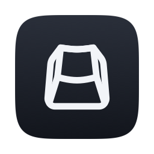

# Ultrakey

macOS 유틸리티 **SuperKey** 의 Rust/Tauri 클론.

- 명세: [`docs/spec/`](docs/spec/) — [`docs/spec/README.md`](docs/spec/README.md) 가 색인이자 구현 순서다
- 구현 구조: [`docs/dev/architecture.md`](docs/dev/architecture.md)
- 아이콘: [`docs/dev/icons.md`](docs/dev/icons.md) — 정본 SVG 하나에서 전량을 다시 만드는 절차
- 에이전트 규약: [`AGENTS.md`](AGENTS.md)

현재 단계: **M1 — 키 이벤트 탭 + 리매핑 엔진** (F-11 권한 · F-07 엔진 · F-14(B) 입력 소스 독립성 · F-05 Hyperkey 최소 동작 · F-10 게이트 인터페이스)

## 요구 환경

| 항목 | 버전 |
| :--- | :--- |
| macOS | 12.0 이상 (제품 결정 D1) |
| Rust | 1.82 이상 |
| Xcode Command Line Tools | 필수. **전체 Xcode 는 필요 없다** ([`platform-constraints.md`](docs/spec/platform-constraints.md) §2) |
| Node.js | Tauri 번들링에 필요 |

```sh
xcode-select --install
rustup target add aarch64-apple-darwin x86_64-apple-darwin
cargo install tauri-cli --version "^2" --locked
```

## 빌드와 테스트

```sh
# 순수 로직 테스트 — macOS 권한도 서명도 필요 없다
cargo test -p ultrakey-core -p ultrakey-i18n -p ultrakey-hyperkey -p ultrakey-layout

# 워크스페이스 전체
cargo test --workspace
cargo clippy --workspace --all-targets -- -D warnings

# 아이콘 재생성 — 정본 assets/app-icon/ultrakey.svg 하나에서 전량을 다시 만든다
# (macOS 기본 도구만 쓴다. PNG 를 직접 편집하지 않는다 — docs/dev/icons.md)
./scripts/generate-icons.sh

# ⭐ 서명된 universal .app — 권한이 필요한 기능은 반드시 이것으로 테스트한다
./scripts/build-signed.sh
./scripts/verify-signature.sh <경로>/Ultrakey.app
```

> ⚠️ **`cargo tauri dev` 로는 권한 기능을 테스트하지 않는다.** `.app` 번들이 아니라 바이너리를 직접 실행하므로 TCC 가 **부모 프로세스(터미널)의 권한**으로 판정한다. 자세한 이유와 M0 서명 절차는 [`docs/dev/code-signing.md`](docs/dev/code-signing.md) 에 있다 — **첫 빌드 전에 그 절차를 먼저 마쳐야 한다.**

## 릴리즈

`v*` 태그를 푸시하면 GitHub Actions(`.github/workflows/release.yml`)가 유니버설 DMG 를 빌드해 **드래프트 릴리즈**를 만든다.
서명·공증 시크릿이 없으면 미서명 빌드로 통과한다(경고만, 실패하지 않는다).
릴리즈 노트는 직전 릴리즈 태그~현재 태그의 커밋 로그에서 자동 추출하고, 게시 전에 사람이 본문을 다듬는다.
시크릿 목록과 설정 절차는 [`docs/dev/code-signing.md`](docs/dev/code-signing.md) §8.

## 크레이트 구성

| 크레이트 | 대응 | 비고 |
| :--- | :--- | :--- |
| `ultrakey-core` | F-07 판정 · F-10 게이트 | macOS 비의존 순수 로직. `#![forbid(unsafe_code)]` |
| `ultrakey-platform` | 플랫폼 경계 | ⭐ **이 저장소의 모든 `unsafe` 가 여기에만 있다** |
| `ultrakey-engine` | F-07 인프라 | 탭 생명주기 · 워치독 · 절전/깨어남 · 핫플러그 |
| `ultrakey-layout` | F-14 (B) | 입력 소스 독립성 |
| `ultrakey-hyperkey` | F-05 | hyper · meh · bleh |
| `ultrakey-seek-session` | **F-01** | Seek 활성화·세션 상태 머신의 순수 로직 — 활성화 3경로 · 세션 생명주기 · 세션 중 키 라우팅 · F-04 경계. macOS 비의존 |
| `ultrakey-overlay` | **F-03** | Seek 오버레이의 순수 로직 — 좌표 변환 · 연결선 클리핑 · 증분 수신 세션. macOS 비의존 |
| `ultrakey-click` | **F-04** | Seek 클릭 실행의 순수 로직 — 클릭 모드 7종 해석 · 지점·계획·경로·화면 밖 판정. macOS 비의존 |
| `ultrakey-permissions` | F-11 | 권한 온보딩과 복구 |
| `ultrakey-i18n` | F-14 (A) / D4 | 문자열 카탈로그 (ko + en) |
| `apps/ultrakey-app` | F-09 · F-10 껍데기 | Tauri 앱 |

경계를 이렇게 나눈 근거와 기각한 대안은 [`docs/dev/architecture.md`](docs/dev/architecture.md) §1 에 있다.

## 검증

- **자동화된 것** — 키코드 매핑, quick press 타이밍 판정, 비트마스크 합성, 중재 계층 short-circuit, 입력 소스 판정, 문자열 카탈로그 커버리지. `cargo test` 로 전부 돈다
- **자동화 불가능한 것** — 실제 탭 동작, 권한 부여, 절전 복귀, 외장 키보드 핫플러그. 절차는 [`docs/dev/manual-verification.md`](docs/dev/manual-verification.md) 에 있다
